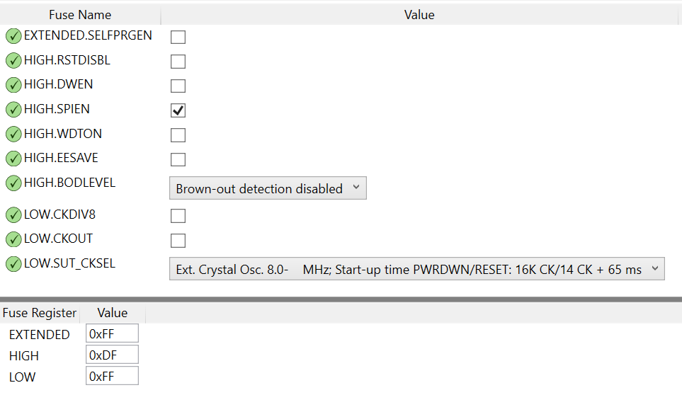

A simple firmware for keeping PCs awake. In a corporate environment we often have to put up with a managed desktop which is set to lock after a short period of inactivity and we are not able to change that configuration. Well you could build a robot to wiggle your mouse every so often or you could build one of these devices which presents itself to the host as a USB mouse and every minute it moves that mouse 1 pixel left and then right again. You'd have to look very carefully to notice yourself but it's enough to keep the PC thinking you are active!

Hardware
========
Design files are shown in the hardware folder and were drawn with KiCad version (5.1.9)-1. The printable folder contains the following:
* a schematic PDF
* a pcb design PDF
* a PDF plot in mirrored negative which I used to create the PCB with negative photo-resist film

Firmware
========
The firmware is built on the fantastic [v-usb](https://github.com/obdev/v-usb) USB driver which provides USB capabilities to AVR devices that lack USB hardware. I have modified one of their samples.

The firmware is built with Microchip Studio 7.0.2542.

Programming
-----------
Set fuses as shown

